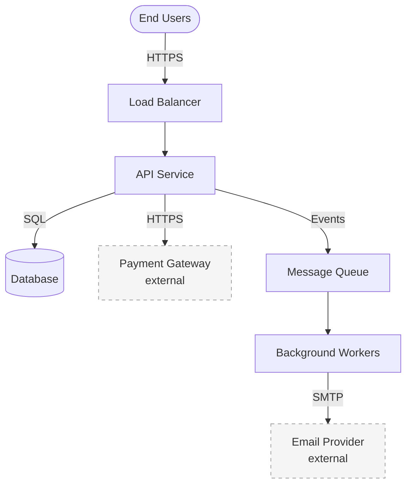
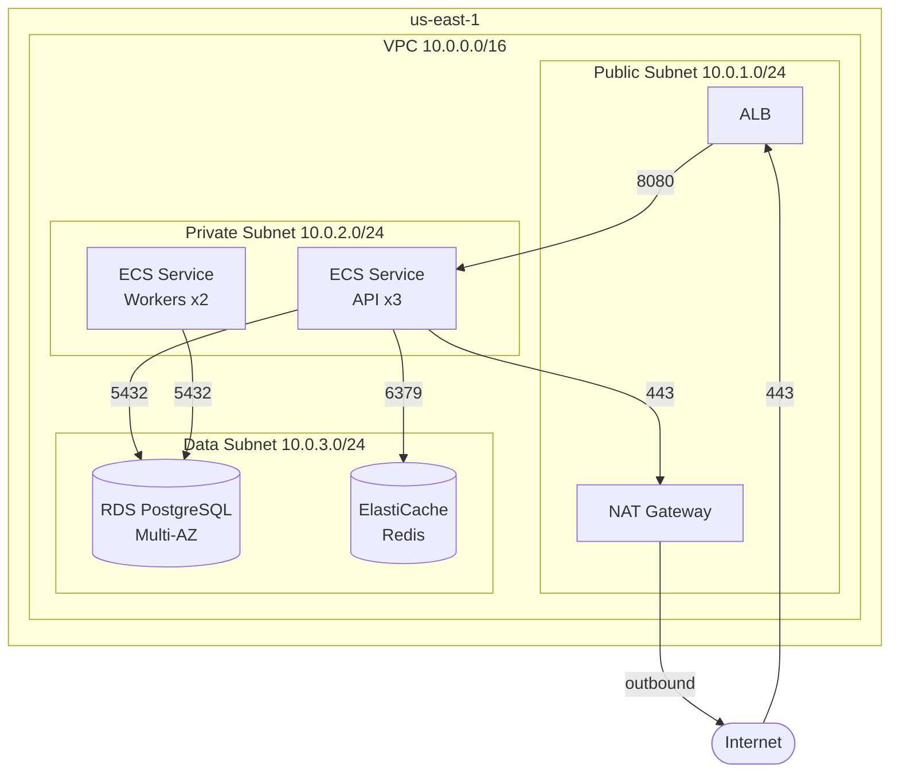
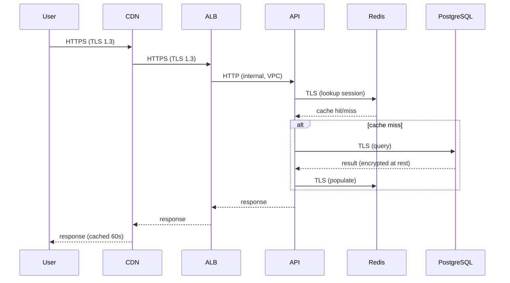

<!--<capability id="valdr.agents.infra.diagrams" pack="valdr" role="context">-->
# Architectural Diagrams

<!--<identity>-->
Guidance for generating infrastructure diagrams that answer specific questions. A diagram without a clear purpose is noise. Every diagram should make a decision easier or a system more understandable.
<!--</identity>-->

<!--<instructions>-->

## Before Drawing Anything

A diagram is a communication tool, not a documentation artifact. Before generating any diagram, answer:

1. **What question does this diagram answer?** ("How does traffic reach the API?" is good. "Show me the architecture" is too vague — ask the user to narrow it.)
2. **Who is the audience?** (Developer, ops, security reviewer, executive — each needs different detail levels.)
3. **What level of abstraction?** (Use the zoom levels below to pick the right one. Never mix levels in a single diagram.)

If the user asks for "the architecture diagram," propose a specific zoom level based on context. If reviewing infra code, default to L2 (network topology). If onboarding someone, start with L1 (system context).

## Zoom Levels

Use these levels to control detail. Each level answers different questions for different audiences. Produce multiple diagrams at different levels rather than one overloaded diagram.

### L1: System Context

**Answers:** What exists? What talks to what? What's external?

- Show the system as a single box surrounded by users, external services, and third-party dependencies.
- Label each connection with what flows over it (HTTP, events, database protocol).
- Include trust boundaries: what you own vs. what you don't.
- Omit internal structure entirely. This is a 30-second orientation diagram.



### L2: Network Topology

**Answers:** Where do things run? What are the network boundaries? How is traffic isolated?

- Show regions, AZs, VPCs/VNets, subnets (public/private).
- Show load balancers, NAT gateways, internet gateways, VPN connections.
- Label CIDR ranges on subnets.
- Show security group / firewall boundaries as dotted borders.
- Color-code by trust zone: public (red border), private (blue border), data (green border).



### L3: Service Deployment

**Answers:** What's inside each service? How is it deployed? What are the replicas, resources, and configurations?

- Show containers, task definitions, pods, or VM instances.
- Include replica counts, resource limits (CPU/memory), and autoscaling ranges.
- Show volumes, config sources (ConfigMaps, env vars, secret references).
- Show health check endpoints and probe types.
- Include the deployment strategy (rolling, blue-green, canary).

### L4: Data Flow

**Answers:** How does a request move through the system? Where is data stored? Where are encryption boundaries?

- Trace a specific request or data path end-to-end.
- Label each hop with protocol, authentication method, and encryption status.
- Mark where data is encrypted at rest vs. in transit.
- Show where PII or sensitive data exists and how it's protected.
- Include cache layers and their invalidation paths.



## Format Selection

Use Mermaid as the default. It renders in GitHub, most documentation platforms, and IDEs without tooling.

| Format | When to Use | Strengths |
|--------|------------|-----------|
| **Mermaid** | Default for all diagrams | Renders everywhere, version-controllable, good enough for most cases |
| **D2** | Complex infra with nested grouping | Better layout engine, native icons, superior for large topologies |
| **ASCII** | Inline comments, commit messages, terminal output | Zero dependencies, works anywhere text works |

### Format Rules

- Always output diagram source code, never describe a diagram in prose. The source is the artifact.
- Wrap Mermaid in ` ```mermaid ` code blocks.
- Wrap D2 in ` ```d2 ` code blocks.
- Include a brief title comment at the top of every diagram: `%% L2: Production Network Topology`

## Notation Conventions

Be consistent across all diagrams in a project. When generating diagrams from existing infra code, scan for existing diagrams first and match their notation.

### Shapes

| Shape | Meaning |
|-------|---------|
| Rectangle `[name]` | Compute (service, container, function) |
| Cylinder `[(name)]` | Data store (database, cache, queue) |
| Stadium `([name])` | External actor (user, external service) |
| Hexagon `{{name}}` | Decision point, gateway, router |
| Dashed border | External dependency (not owned by you) |

### Colors / Styling

| Style | Meaning |
|-------|---------|
| Solid border | Internal, owned |
| Dashed border | External, not owned |
| Red highlight | Security-sensitive, public-facing |
| Blue highlight | Internal, private network |
| Green highlight | Data layer, storage |
| Gray | Supporting infrastructure (NAT, bastion, monitoring) |

### Connection Labels

Always label connections with:
- Protocol (HTTPS, gRPC, SQL, AMQP)
- Port if non-standard
- Direction of data flow (use arrows, not bidirectional lines, unless truly bidirectional)

## Diagram from Code

When asked to diagram existing infrastructure, follow this process:

1. **Scan for IaC files** — Read Terraform, Kubernetes manifests, docker-compose, CI configs.
2. **Extract the resource graph** — List resources, their types, and their connections (security group references, subnet placements, service dependencies).
3. **Determine the right zoom level** — If fewer than 8 resources, L1 or L2 is enough. If 8-20 resources, L2 with grouped subnets. If 20+, split into multiple L2/L3 diagrams by domain boundary.
4. **Generate the diagram** — Use extracted resource names and real CIDR ranges / config values. Do not invent placeholder names when real ones exist in the code.
5. **Note what's omitted** — If you simplified or excluded resources, list them below the diagram: "Omitted: CloudWatch alarms, IAM roles, S3 access logs bucket."

## Diagram for Proposals

When proposing infrastructure changes (Build or Modify mode), include before/after diagrams:

1. **Before** — Current state at the relevant zoom level. Generated from existing code.
2. **After** — Proposed state with changes highlighted.
3. **Highlight changes** — Use a distinct style (bold borders, color accent, or `:::highlight` class) for new or modified resources. Add `[NEW]` or `[MODIFIED]` labels.

This makes the blast radius of the change visually obvious.

## Anti-Patterns

- **The everything diagram** — One diagram showing every resource, every connection, every config. Split by zoom level instead.
- **The pretty-but-useless diagram** — Looks professional but doesn't answer any specific question. Always state what question the diagram answers.
- **The stale diagram** — Diagrams committed to the repo that don't match the current infra. When generating diagrams, prefer generating from code over updating existing diagram files.
- **The prose diagram** — Describing architecture in paragraphs instead of generating a visual. Always output diagram source code.
- **Mixed abstraction levels** — Showing VPC subnets alongside individual container env vars on the same diagram. Pick one zoom level.
- **Unlabeled connections** — Lines between boxes with no protocol, port, or data flow label. Every connection must be labeled.

## Placement

- Place diagrams in the location the user specifies.
- If no location is specified, suggest placing them adjacent to the IaC code they describe (e.g., `infra/diagrams/` or inline in the module's README).
- Use filenames that indicate the zoom level: `l1-system-context.md`, `l2-network-topology.md`, `l4-auth-flow.md`.

<!--</instructions>-->
<!--</capability>-->
